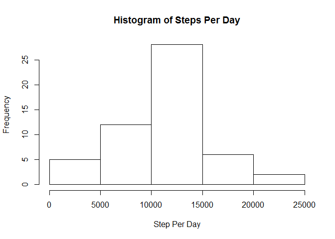
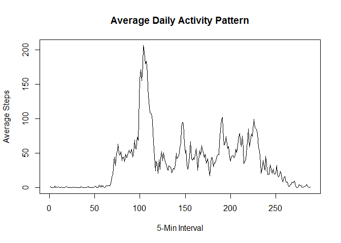
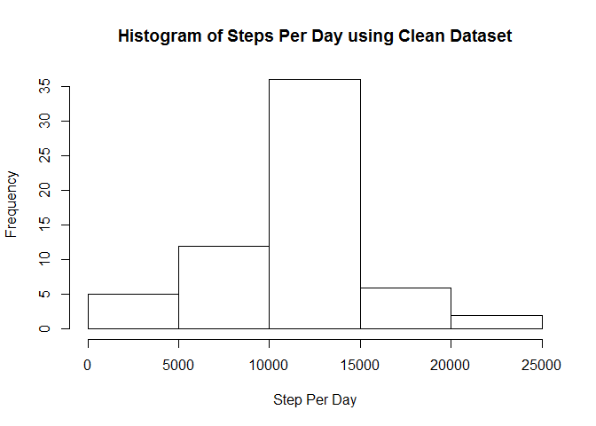

# Reproducible Research: Peer Assessment 1

## Introduction

It is now possible to collect a large amount of data about personal movement 
using activity monitoring devices such as a [Fitbit](http://www.fitbit.com), 
[Nike Fuelband](http://www.nike.com/us/en_us/c/nikeplus-fuelband), or
[Jawbone Up](https://jawbone.com/up). These data remain under-utilized both 
because the raw data are hard to obtain and there is a lack of statistical 
methods and software for processing and interpreting the data.

This assignment makes use of data from a personal activity monitoring device. 
This device collects data at 5 minute intervals through out the day. The data 
consists of two months of data from an anonymous individual collected during 
the months of October and November, 2012 and include the number of steps taken 
in 5 minute intervals each day.

## Loading and preprocessing the data

The data for this assignment can be downloaded from the course web site:

* Dataset: [Activity monitoring data](https://d396qusza40orc.cloudfront.net/repdata%2Fdata%2Factivity.zip) [52K]

The variables included in this dataset are:

* **steps**: Number of steps taking in a 5-minute interval (missing
    values are coded as `NA`)
* **date**: The date on which the measurement was taken in YYYY-MM-DD
    format
* **interval**: Identifier for the 5-minute interval in which
    measurement was taken

The dataset is stored in a comma-separated-value (CSV) file..


```r
data.raw <- read.csv("activity.csv")
record.count <- nrow(data.raw)
summary(data.raw)
```

```
##      steps                date          interval     
##  Min.   :  0.00   2012-10-01:  288   Min.   :   0.0  
##  1st Qu.:  0.00   2012-10-02:  288   1st Qu.: 588.8  
##  Median :  0.00   2012-10-03:  288   Median :1177.5  
##  Mean   : 37.38   2012-10-04:  288   Mean   :1177.5  
##  3rd Qu.: 12.00   2012-10-05:  288   3rd Qu.:1766.2  
##  Max.   :806.00   2012-10-06:  288   Max.   :2355.0  
##  NA's   :2304     (Other)   :15840
```

There are a total of 17568 observations in this dataset

## What is mean total number of steps taken per day?

For this part of the analysis, we ignore any day with missing values and 
explore total steps per day through a histogram and descriptive statistics.


```r
dates.total.steps <- tapply(data.raw$steps, data.raw$date, sum)
raw.mean.steps.per.day <- prettyNum(mean(dates.total.steps,na.rm=TRUE),big.mark=',')
raw.median.steps.per.day <- prettyNum(median(dates.total.steps,na.rm=TRUE),big.mark=',')
hist(dates.total.steps, main='Histogram of Steps Per Day', xlab='Step Per Day')
```

 

The histogram above shows the distribution of steps per day over the
measurement period.  The mean of this distribution is 10,766.19
steps per day and the median of this distribution is 10,765
steps per day.

## What is the average daily activity pattern?

The time series below shows the average number of steps taken, averaged across
all days of the measurement period.  


```r
intervals.mean.steps = tapply(data.raw$steps, data.raw$interval, function(x){mean(x, na.rm=TRUE)})
plot(intervals.mean.steps, type='l', main="Average Daily Activity Pattern", 
     xlab='5-Min Interval', ylab='Average Steps')
```

 

```r
intervals.max <- which.max(intervals.mean.steps)
intervals.max.time <- format(as.POSIXct('2012-01-23 00:00:00 EST')+intervals.max*5*60,'%I:%M %P')
```

This chart shows that, on average, interval 104 (The 5-minute 
interval starting at 08:40 am) has the most activity during the day.

## Imputing missing values

Note that there are a number of days/intervals where there are missing. The 
presence of missing days may introduce bias into our analysis.


```r
records.total.na <- sum(is.na(data.raw$steps))
```

The raw dataset contains a total of 2304 missing records.  We
will fill any missing records using the overall mean of steps per interval.


```r
raw.mean.steps.per.interval <- prettyNum(mean(data.raw$steps,na.rm=TRUE),big.mark=',')
```

Any 5-minute interval that is missing data, is given a value of 
37.3826 steps.  This is an extremely unsophisticated 
strategy, but serves the purpose of the assignment.


```r
data.clean <- data.raw
data.clean[is.na(data.clean$steps), ]$steps <- as.numeric(raw.mean.steps.per.interval)
summary(data.clean)
```

```
##      steps                date          interval     
##  Min.   :  0.00   2012-10-01:  288   Min.   :   0.0  
##  1st Qu.:  0.00   2012-10-02:  288   1st Qu.: 588.8  
##  Median :  0.00   2012-10-03:  288   Median :1177.5  
##  Mean   : 37.38   2012-10-04:  288   Mean   :1177.5  
##  3rd Qu.: 37.38   2012-10-05:  288   3rd Qu.:1766.2  
##  Max.   :806.00   2012-10-06:  288   Max.   :2355.0  
##                   (Other)   :15840
```


```r
dates.total.steps.clean <- tapply(data.clean$steps, data.clean$date, sum)
clean.mean.steps.per.day <- prettyNum(mean(dates.total.steps.clean),big.mark=',')
clean.median.steps.per.day <- prettyNum(median(dates.total.steps.clean),big.mark=',')
hist(dates.total.steps.clean, main='Histogram of Steps Per Day using Clean Dataset', xlab='Step Per Day')
```

 

The histogram above shows the distribution of steps per day when using the clean
dataset.  The mean of this distribution is 10,766.19 steps per 
day and the median of this distribution is 10,766.19 steps per day.

Note that the daily median of the clean dataset distribution is a little over 1 
step higher than the raw median of 10,765 steps per day, 
but the daily mean of the clean dataset is unchanged.  This shows that imputing
missing data in this way has little impact on estimation of total daily steps.

## Are there differences in activity patterns between weekdays and weekends?


```r
data.clean$dayType <- as.factor(ifelse(weekdays(as.Date(data.clean$date)) == "Saturday" | 
                               weekdays(as.Date(data.clean$date)) == "Sunday", 
                               "Weekend", "Weekday"))
```

Created a new factor variable in the dataset with two levels -- "weekday" and "weekend" indicating whether a given date is a weekday or weekend day.
